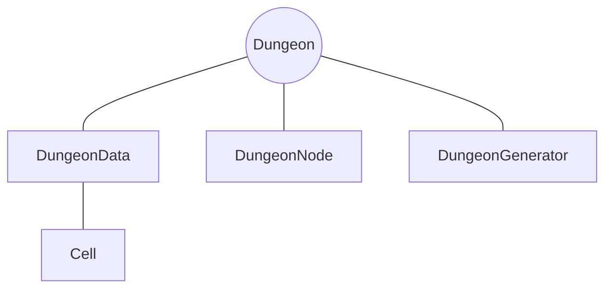

# <span class=class>Dungeon</span>


```mermaid
graph TD
  n1@{ shape: "circle", label: "Dungeon" }
  n1 --- n5["DungeonData"]
  n1 --- n2["DungeonNode"]
  n1 --- n3["DungeonGenerator"]
  n5 --- n4["Cell"]

  click n5 "/dungeon/dungeon_data/" "Go to DungeonData docs"
  click n3 "/dungeon/dungeon_generator/" "Go to DungeonGenerator docs"
  click n2 "/dungeon/dungeon_node/" "Go to DungeonNode docs"
```

```gdscript title="Dungeon.gd" linenums="1"

class_name Dungeon

var data: DungeonData

var generator: DungeonGenerator

var width: int
var height: int
```
