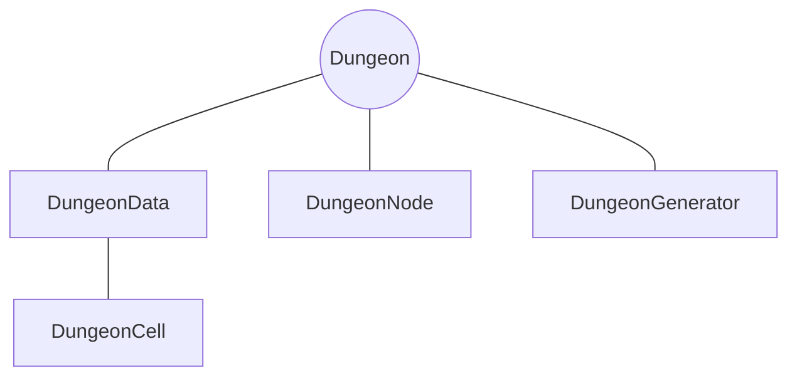

# <span class=class>Dungeon</span>



### Functions
```gdscript
func generate():

```

```gdscript
func get_cell(pos: Vector2i) -> DungeonCell:

```

```gdscript
func get_neighbors(pos: Vector2i):

```

```gdscript
func print_grid(mode: String, border: bool = false):

```

```gdscript
func count_non_wall_cells() -> int:

```
