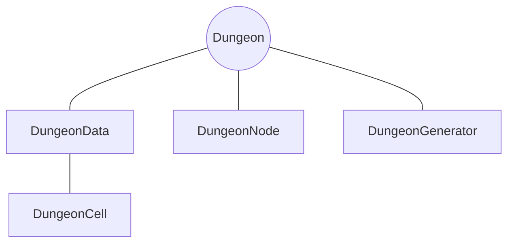

# <span class=class>Dungeon</span>
Main controller class responsible for managing dungeon generation and accessing dungeon data.



## Class variables
<div class="variable_table">

  <div class="variable_header">
    <span>Variable</span>
    <span>Type</span>
    <span>Description</span>
  </div>

  <div class="variable_line">
    <span>data</span>
    <span>DungeonData</span>
    <span>Stores the generated dungeon data, including the grid and cell information.
  </div>

  <div class="variable_line">
    <span>generator</span>
    <span>DungeonGenerator</span>
    <span>Handles the procedural dungeon generation process.
  </div>

  <div class="variable_line">
    <span>width</span>
    <span>int</span>
    <span>Defines the horizontal size of the dungeon grid.
  </div>

  <div class="variable_line">
    <span>height</span>
    <span>int</span>
    <span>Defines the vertical size of the dungeon grid.
  </div>

</div>

## Functions

<div class="box">
```gdscript
func generate():

```
Generates a new dungeon and stores the resulting dungeon data.
</div>

<div class="box">
```gdscript
func get_cell(pos: Vector2i) -> DungeonCell:

```
Returns the dungeon cell at the specified position, or null if no dungeon has been generated.
</div>

<div class="box">
```gdscript
func get_neighbors(pos: Vector2i):

```
Returns the neighboring cells of the specified position, or an empty dictionary if no dungeon exists.
</div>

<div class="box">
```gdscript
func print_grid(mode: String, border: bool = false):

```
Prints a text representation of the dungeon grid using the selected display mode.
</div>

<div class="box">
```gdscript
func count_non_wall_cells() -> int:

```
Returns the number of non-wall cells in the generated dungeon.
</div>


