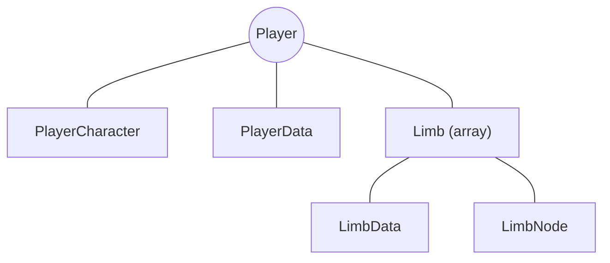

# <span class=class>Player</span>


```mermaid
flowchart
  n1@{ shape: "circle", label: "Player" }
  n1 --- n2["PlayerCharacter"]
  n1 --- n3["PlayerData"]
  n1 --- n5["Limb (array)"] --- n4["LimbData"]
  n5 --- n6["LimbNode"]

  click n3 "/player/player_data/" "Go to PlayerData docs"
  click n2 "/player/player_character/" "Go to PlayerCharacter docs"
  click n5 "/player/limb/" "Go to Limb docs"
  click n4 "/player/limb/limb_data" "Go to LimbData docs"
  click n6 "/player/limb/limb_node" "Go to LimbNode docs"

```

### Functions
```gdscript


```
